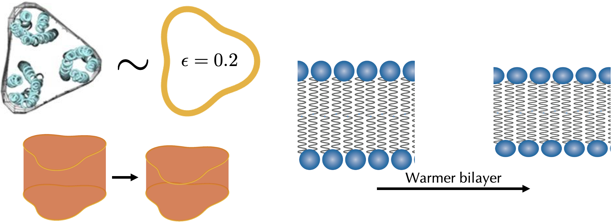

Research

 

Membrane thermosensing

 

> 
We can model a chemoreceptor as a button with a 3-leaf clover cross-section shape in a bilayer with material constants, including unperturbed thicknesses, that are dependent on temperature.

 

Bacteria motility has been observed for over 300 years. Some bacteria, like <i>Escherichia coli</i> have flagella, which are whip-like appendages, they can rotate in a helical motion such as to produce an anisotropic drag that propels them forward through fluid. In bulk fluid, <i>E. coli</i> performs a two state motion characterized by straight runs punctuated by fast tumbles in which the bacteria slow to a stop and re-orient their swimming direction [Adler, 1966]. In the presence of a chemoattractant or chemorepellant, the bacteria bias their motion via a process known as chemotaxis. When bacteria travel towards increasing chemoattractants or decreasing chemorepellants, the signaling pathway chemoreceptors through which <i>E. coli</i> control their flagellar motor reduce the rate of tumbles (re-orientations) resulting in the bacteria netting motion towards chemoattractants or away from chemorepellants [Paulick et. al, 2017].
  
A few years ago, it was shown that in the absence of chemoattractants and chemorepellants, <i>E. coli</i> thermotaxis to warmer temperatures using some of the same chemoreceptors involved in chemotaxis [Paulick et. al, 2017]. Experimental work previously measured the dependence on temperature of DOPC bilayer material constants and show that DOPC lipid bilayers decrease in hydrophobic thickness and are easier to deform in warmer temperatures [Pan et. al, 2008]. We can adapt these relationships to an <i>E. coli</i> cytoplasmic membrane which is thicker than DOPC [Mitra et. all 2004].
  
We present a temperature dependent bilayer mechanical model which suggests that <i>E. coli</i>'s thermotactic abilities may be accounted for by protein-bilayer mechanical interactions. Chemoreceptors have roughly a 3-leaf clover cross-section shape and thicknesses that decrease when activated and so we can model a chemoreceptor as a button or switch with a 3-leaf clover cross-section shape [Haselwandter and Wingreen, 2014]. Using the boundary value method from our earlier work [Alas and Haselwandter, 2022], we calculated the contribution associated with the protein-bilayer mechanical interactions in the activation of a chemoreceptor, from its off state to its on state, and found that this energy cost is on the order of methylation energies of chemoreceptors [Shimizu et. al, 2010]. Our results suggest that moderate increases in temperature can activate the chemoreceptors causing the bacteria to swim towards warmer temperature. So protein-bilayer interactions may account for the temperature sensing of cells. 
  
We are in the process of finalizing our results in manuscript. We will also be presenting our results at the upcoming APS March Meeting in Las Vegas, Nevada. A preview of our results are discussed in my <a href="https://www.youtube.com/embed/bMl28r7R7YY">APS March 2022 meeting video recording</a> and in our <a href=https://www.cdalas.com/posters/qcb-2022/qcb-2022-poster.pdf">USC Computation Biology Symposium (CBS) 2022 poster</a>. Stay tuned for updates on progress in our manuscript and video recording of my talk at the APS March 2023 meeting.

