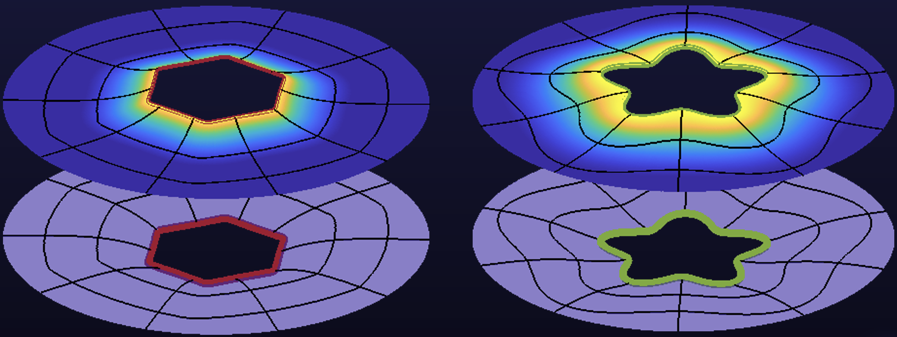

Protein bilayer deformations

 

Membrane proteins serve a number of important functions for the cell, such as maintaining cell shape and the transport of essential materials into or out of the cell. In a cell membrane, proteins and lipids are held together in a bilayer structure by amphiphilic interactions, with protein thicknesses usually similar to the bilayer's unperturbed thickness. Since distinct proteins generally span distinct hydrophobic thicknesses and lipid composition can yield heterogeneity in unperturbed bilayer thickness, proteins induce lipid bilayer thickness deformations. The energy cost of these deformations depends on the protein shape, lipid composition, and mechanical properties of the membrane, and so can regulate protein function. With the bilayer material constants measureable by experiments, in the simplest model, membrane elasticity theory can capture the energetic cost of bilayer deformations and, thus, quantify the relationship between membrane protein function and lipid bilayer mechanics. For the past two decades, experimental advancements in resolving protein structure have taught us a great deal about protein shape. However, deformation energy calculations, historically, have largely assumed proteins to have rotational symmetry. In our work, currently being peer reviewed, we present, validate, and benchmark a boundary value method (BVM) for constructing nonperturbative analytical solutions of protein induced bilayer thickness deformations due to protein shapes obtained from structural biology. We then apply the BVM to systematically survery the dependence of bilayer thickness deformations on protein shape, the relative stability of protein shapes, and the stability of oligomers. 

> 
Bilayer deformation surfaces induced by protein's of non-circular cross-sections calculated by boundary value method (BVM)

  
