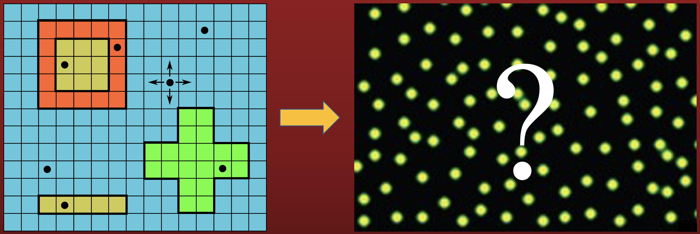

Research

 

Stochastic lattice model for emerin nanodomains

 

> 
Can we use a stochastic lattice model to predict experimentally observed properties of emerin's organization and self-assembly on the nuclear membrane? (image credits: left panel of image is from [(B) Li et. al, 2017] and right panel of image is from [Haselwandter et. al, 2011])

 
<!-- 
 -->
Emerin is a nuclear membrane protein (of mammalian cells) involved in the transduction of membrane mechanical signals between the cytoskeleton and the nucleoskeleton, and is thought to be central to a range of nuclear processes, including those which involve the maintenance of the architecture of the nucleus and its protection against mechanical stress.  When mutated or absent, emerin causes X-linked Emery-Dreifuss muscular dystrophy (EDMD). Superresolution fluorescence microscopy experiments show that when nuclei are presented with mechanical challenges, emerin mechanotransduction functions are coupled to changes in its oligomeric state and that nuclear shape adaptation against mechanical forces is governed by the self-assembly of emerin [Fernandez et. al, 2022]. In steady state, emerin organizes into monomer clusters about 200-300 nanometers in diameter, which envelope many smaller oligomer clusters, that are stabilized by emerin interactions with nuclear binding partners. Correct emerin interactions with nuclear binding partners and formation of oligomer clusters appear to be necessary for nuclei to adapt properly to mechanical stress, which is not what is observed of EDMD mutants.
{{< /typography >%}}
    
 Even though emerin nanodomains and synaptic domains of (glycine) receptor molecules in neurons differ in chemical composition and biological roles, physically and mathematically, they appear to share many important properties that are insightful to study. The similarities between emerin nanodomains and synaptic domains may suggest a possible map between the two phenomena. Experiments on a minimal system and a corresponding reaction-diffusion model suggest that the reaction and diffusion properties of synaptic receptors and their associated scaffold molecules are necessary and sufficient for the observed self-assembly, stability, and characteristic size of synaptic receptor domains [Haselwandter et al., 2011]. A stochastic lattice model proved successful in its ability to capture the self-assembly, stability, and size of synaptic domains observed in experiments [Kahraman et. al, 2016, (A) Li et. al, 2017, (B) Li et. al, 2017, Law et. al, 2021].
Drawing analogies between emerin nanodomains and receptor synaptic domains may provide a starting point for an understanding of the self-assembly of emerin monomer and/or oligomer domains. We are currently preparing a manuscript which introduces a stochastic lattice model for predicting properties of emerin nanodomains, which will be a first step towards understanding how improper emerin self-assembly and organization can lead to EDMD. Tune in for progress updates on this exciting work!
{{< /typography >%}}
<!-- 
 -->
