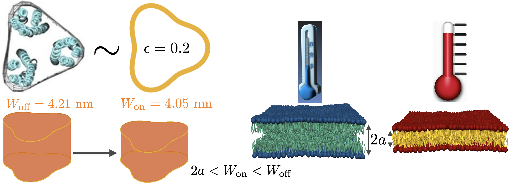


  Research


 


  Thermosensing through membrane mechanics




> 
    We can model a chemoreceptor as a button with a 3-leaf clover cross-section shape in a bilayer with material constants, including unperturbed thicknesses, that are dependent on temperature. (image credits: left side image with chemoreceptor structure and shape model comes from [Liu et. al, 2012, Haselwandter and Wingreen, 2014] and right side with warmer temperature decreasing bilayer thickness concept is from [Pan et. al., 2008] where I created the warm and cold bilayer images in Blender.)
  

 




  APS March Meeting 2023 talk in Las Vegas, NV



 



  Bacteria motility has been observed for over 300 years. Some bacteria, like <i>Escherichia coli</i> have flagella which are whip-like appendages they can rotate in a helical motion such as to produce an anisotropic drag that propels them forward through fluid. In bulk fluid, <i>E. coli</i> performs a two state motion characterized by straight runs punctuated by fast tumbles in which the bacteria slow to a stop and re-orient their swimming direction [Adler, 1966]. In the presence of a chemoattractant or chemorepellant, the bacteria bias their random motion via a process known as chemotaxis. When bacteria travel towards increasing chemoattractants or decreasing chemorepellants, chemoreceptors activate a signaling pathway through which <i>E. coli</i> control their flagellar motor to reduce the rate of tumbles (re-orientations) resulting in the bacteria netting motion towards chemoattractants or away from chemorepellants. A few years ago, Viktor Sourjik and others [Paulick et. al, 2017] showed that in the absence of any triggering chemicals, <i>E. coli</i> thermotax to warmer temperatures using the same signaling pathway involved in chemotaxis.

 

   A couple years ago, David Julius and Ardem Patapoutian received nobel prizes in recognition for their work in understanding how the nervous system encodes sensory information. Their work taught us that cells coordinate certain ion channels to gain sensitivity of temperature over a broad range. Yet, it still remains to be shown how the ion channels are activated by temperature.

   For many decades, membrane elasticity theory has been used to study protein-induced bilayer deformations through which we've learned that protein function is in general coupled to membrane mechanical properties which can change with temperature. Experimental work has roughly measured the dependence on temperature of DOPC membrane mechanical properties and demonstrated that DOPC membranes decrease in hydrophobic thickness and are easier to deform in warmer temperatures [Pan et. al, 2008]. We can adapt these relationships to <i>E. coli</i> cytoplasmic membranes which are thicker than DOPC membranes [Mitra et. all 2004]. Through an insertion of these temperature-dependent relations into membrane elasticity theory, we can study how protein function can be affected by temperature.

 

Our temperature dependent membrane mechanical model suggests that <i>E. coli</i>'s thermotactic abilities may be accounted for by membrane mechanical interactions. Chemoreceptors have roughly a 3-leaf clover cross-section shape and thicknesses that decrease when activated and so we can model a chemoreceptor as a button or switch with a 3-leaf clover cross-section shape [Haselwandter and Wingreen, 2014]. Using the boundary value method from our earlier work [Alas and Haselwandter, 2023], we calculated the contribution associated with the membrane mechanical interactions in the activation of a chemoreceptor, from its off state to its on state, as a function of temperature and found that moderate increases in temperature can decrease this energy cost by an amount on the order of methylation energies [Shimizu et. al, 2010]. Our results suggest that moderate increases in temperature may be sufficient to activate the chemoreceptors, allowing bacteria to re-purpose them for thermotaxis. So membrane mechanics may provide a generic physical mechanism through which protein sensors may be activated by temperature and impart cells with thermosensing capabilities. 

 

We are in the process of finalizing our results in manuscript.
